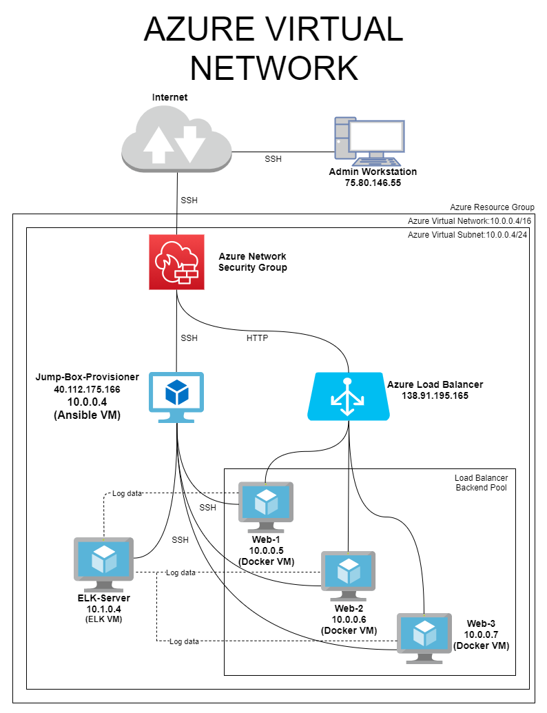

# info-sec
## Automated ELK Stack Deployment

The files in this repository were used to configure the network depicted below.

These files have been tested and used to generate a live ELK deployment on Azure. They can be used to recreate the entire deployment pictured above. Alternatively, select portions of the /Ansible scripts may be used to install only certain pieces of it, such as Filebeat.

[Example YAML file to install Filebeat](Ansible/install-filebeat.yml)

This document contains the following details:
- Description of the Topology
- Access Policies
- ELK Configuration
  - Beats in Use
  - Machines Being Monitored
- How to Use the Ansible Build

### Description of the Topology

The main purpose of this network is to expose a load-balanced and monitored instance of DVWA, the D*mn Vulnerable Web Application.

Load balancing ensures that the application will be highly efficient and available, in addition to restricting access to the network. Admin traffic is funneled through a jump box. 

Integrating an ELK server allows users to easily monitor the vulnerable VMs for changes to log files, operating system, and system services.

The configuration details of each machine may be found below.

| Name                 | Function  | IP Address | Operating System        | Public IP Address |
|----------------------|-----------|------------|-------------------------|-------------------|
| Jump-Box-Provisioner | Gateway   | 10.0.0.4   | Ubuntu 18.04 Server LTS | 40.112.175.166    |
| Web-1                | DVWA Host | 10.0.0.5   | Ubuntu 18.04 Server LTS |                   |
| Web-2                | DVWA Host | 10.0.0.6   | Ubuntu 18.04 Server LTS |                   |
| Web-3                | DVWA Host | 10.0.0.7   | Ubuntu 18.04 Server LTS |                   |
| ELK-Server           | Monitor   | 10.1.0.4   | Ubuntu 18.04 Server LTS | 52.247.218.13     |

### Access Policies

The machines on the internal network are not exposed to the public Internet. 

Only the Jump-Box-Provisioner machine can accept connections from the Internet. Access to this machine is only allowed from the following public IP addresses:
75.80.146.55 (my personal PC)

Machines within the network can only be accessed by the Jump-Box-Provisioner.

A summary of the access policies in place can be found in the table below.

| Name                 | Publicly Accessible | Allowed IP Addresses |
|----------------------|---------------------|----------------------|
| Jump-Box-Provisioner | Yes                 | 75.80.146.55         |
| Web-1                | No                  | 10.0.0.4             |
| Web-2                | No                  | 10.0.0.4             |
| Web-3                | No                  | 10.0.0.4             |
| Elk-Server           | Yes                 | 75.80.146.55         |

### Elk Configuration

Ansible was used to automate configuration of the ELK machine. No configuration was performed manually which allows continuous deployment and integration to reduced drift between VMs. Consistent, uniform configuration speeds up the deployment of updates, patches, or other changes to the VMs.

The [Install Elk](Ansible/install-elk.yml) playbook implements the following tasks:
- Install docker.io, pip, and docker
- Increase the VM memory
- Pull docker image and create container
- Enable docker to run on boot

The following screenshot displays the result of running `docker ps` after successfully configuring the ELK instance.

### Target Machines & Beats
This ELK server is configured to monitor the following machines:

| Name  | IP Address |
|-------|------------|
| Web-1 | 10.0.0.5   |
| Web-2 | 10.0.0.6   |
| Web-3 | 10.0.0.7   |

We have installed the following Beats on these machines:
- `filebeat`
- `metricbeat`

These Beats allow us to collect the following information from each machine:
- `filebeat` monitors and collects log events. 
- `metricbeat` collects info from the operating system and services.

### Using the Playbook
In order to use the playbook, you will need to have an Ansible control node already configured. Assuming you have such a control node provisioned: 

SSH into the control node and follow the steps below:
- Copy the [install-elk.yml](Ansible/install-elk.yml) file to `/etc/ansible`
- Update the ansible `/etc/ansible/hosts` file to include ELK server private IP under a new parameter `[elk]`. It should look like the following:

- Run the playbook with `ansible-playbook /etc/ansible/ansible-playbook install-elk.yml`, and navigate to `http://<YOUR.ELK.VM.External.IP>:5601/app/kibana` to check that the installation worked as expected.
